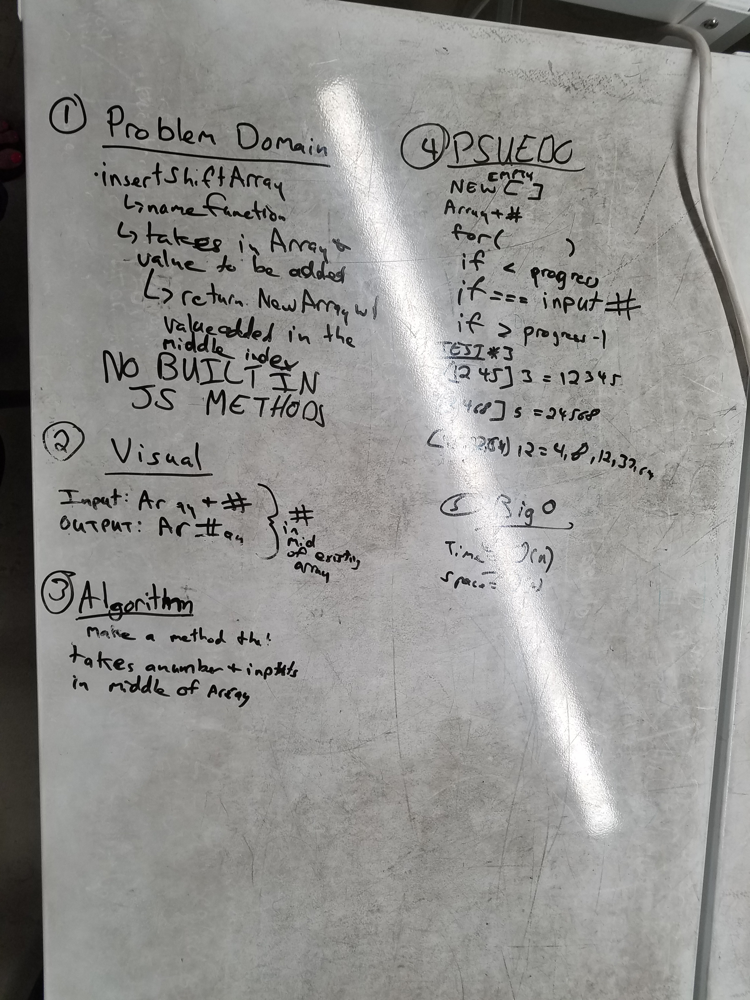

## 02-array-shift
Write a function called insertShiftArray which takes in an array and the value to be added. 

## Challenge
Without utilizing any of the built-in methods available to your language,return an array with the new value added at the middle index.

## Solution
