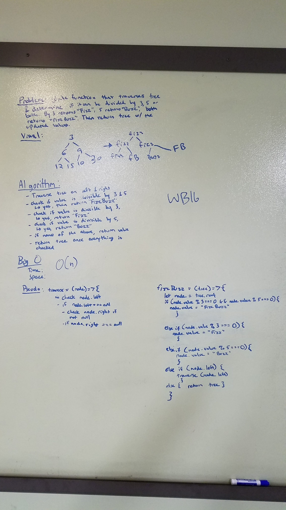

## 16-fizz-buzz-tree
Write a function called FizzBuzzTree which takes a tree as an argument.

## Challenge
Without utilizing any of the built-in methods available to your language, determine weather or not the value of each node is divisible by 3, 5 or both, and change the value of each of the nodes respectively. Return the tree with it’s news values.

## Solution pic
